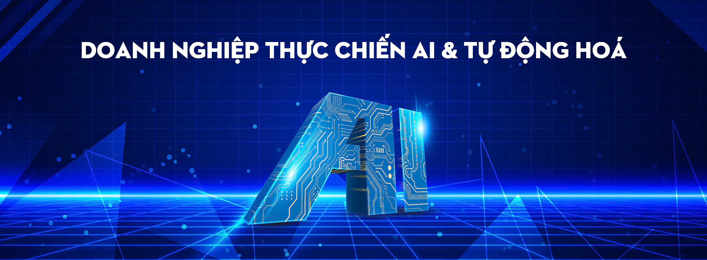

# Brand Guideline — Doanh Nghiệp Thực Chiến AI & Tự Động Hoá

> Dựa trên thiết kế nhận diện từ ảnh bìa Facebook Group



---

## 1. Tên thương hiệu

**Tên tiếng Anh:** AI-First Business Community

**Tên tiếng Việt:** Doanh Nghiệp Thực Chiến AI & Tự Động Hoá

**Tên viết tắt:** AIFB

---

## 2. Sứ mệnh & Giá trị cốt lõi

### Sứ mệnh
Kết nối chủ doanh nghiệp Việt Nam với các giải pháp AI & Tự Động Hoá đáng tin cậy, giúp tối ưu vận hành, tăng năng suất và giảm chi phí thông qua một cộng đồng được kiểm duyệt chất lượng.

### Giá trị cốt lõi

| Giá trị | Mô tả |
|---------|-------|
| **Thực chiến** | Chỉ chia sẻ kiến thức ứng dụng được, không lý thuyết suông, không FOMO |
| **Minh bạch** | Mọi nhà cung cấp đều được kiểm duyệt, mọi đánh giá đều khách quan |
| **Chất lượng** | Thành viên được sàng lọc, nội dung được kiểm soát, giải pháp được review |
| **Kết nối** | Cầu nối an toàn giữa doanh nghiệp có nhu cầu và nhà cung cấp uy tín |

---

## 3. Bảng màu

Bảng màu được lấy trực tiếp từ ảnh bìa Facebook Group — phong cách công nghệ cao, tông xanh dương đậm chủ đạo với điểm nhấn cyan phát sáng và vàng amber trên mạch điện tử.

### Màu chính (Primary)

| Tên | Hex | RGB | Dùng cho |
|-----|-----|-----|----------|
| **Midnight Blue** | `#0A1628` | 10, 22, 40 | Nền chính, header, footer |
| **Royal Blue** | `#1B3A6B` | 27, 58, 107 | Nền phụ, gradient, card |
| **Neon Cyan** | `#00D4FF` | 0, 212, 255 | Accent chính, CTA, links, highlight |
| **White** | `#FFFFFF` | 255, 255, 255 | Text trên nền tối, headings |

### Màu phụ (Secondary)

| Tên | Hex | RGB | Dùng cho |
|-----|-----|-----|----------|
| **Circuit Gold** | `#D4A520` | 212, 165, 32 | Badge, Golden List, điểm nhấn premium |
| **Soft Cyan** | `#E0F7FF` | 224, 247, 255 | Nền info box, highlight nhẹ trên nền sáng |
| **Light Gray** | `#F3F4F6` | 243, 244, 246 | Nền email, nền sáng |
| **Slate** | `#8899AA` | 136, 153, 170 | Text phụ, caption |

### Gradient chính

```
background: linear-gradient(135deg, #0A1628 0%, #1B3A6B 50%, #0A1628 100%);
```

### Gradient accent (lưới sáng)

```
background: linear-gradient(180deg, #1B3A6B 0%, #00D4FF 100%);
```

---

## 4. Typography

### Font chính
- **Tiêu đề:** Inter Bold / Semi-Bold
- **Body:** Inter Regular
- **Fallback (email):** Arial, Helvetica Neue, Helvetica, sans-serif

### Kích thước chữ

| Thành phần | Desktop | Mobile |
|------------|---------|--------|
| H1 | 36px | 28px |
| H2 | 28px | 22px |
| H3 | 20px | 18px |
| Body | 16px | 15px |
| Caption | 14px | 13px |
| Small | 12px | 12px |

---

## 5. Giọng điệu (Tone of Voice)

- **Chuyên nghiệp nhưng gần gũi** — Nói chuyện như một chuyên gia đáng tin, không xa cách
- **Đi thẳng vào vấn đề** — Không dài dòng, ưu tiên giá trị thực tế
- **Tôn trọng** — Dùng "anh/chị" khi xưng hô, tránh giọng bề trên
- **Hành động** — Luôn kết thúc bằng next step rõ ràng

### Nên ✅

- "Giải pháp này đã giúp giảm 40% thời gian xử lý đơn hàng"
- "Anh/chị sẽ nhận cuộc gọi từ đội ngũ trong vòng 24 giờ"

### Không nên ❌

- "AI sẽ thay đổi thế giới" (FOMO)
- "Đừng bỏ lỡ cơ hội ngàn năm có một" (phóng đại)

---

## 6. Badge thành viên

| Badge | Màu | Đối tượng |
|-------|-----|-----------|
| 🏢 Member | Neon Cyan `#00D4FF` | Chủ doanh nghiệp / C-Level |
| 🛠️ Provider | Royal Blue `#1B3A6B` | Nhà cung cấp giải pháp |
| 🔍 Reviewer | Circuit Gold `#D4A520` | Chuyên gia đánh giá |
| ⭐ Golden List | Gold gradient | Nhà cung cấp uy tín |
| 🛡️ Admin | Midnight Blue `#0A1628` | Đội ngũ quản trị |

---

## 7. Email Guidelines

- **Chiều rộng:** tối đa 600px
- **Padding nội dung:** 24–32px
- **Font:** Arial, Helvetica, sans-serif (web-safe)
- **CTA button:** Neon Cyan `#00D4FF` text trên nền Midnight Blue, hoặc nền Neon Cyan text Midnight Blue
- **Border-radius:** 8px
- **Email liên hệ:** info@sisuai.net

---

## 8. Social Media

### Facebook Group
- **Ảnh bìa:** 1640 × 856px
- **Bài post thumbnail:** 1200 × 630px
- **Hashtag bắt buộc:** `#casestudy` `#demo` `#showcase` `#debai` `#giaiphap` `#review` `#hoidap` `#kienthuc` `#event` `#chiase` `#networking`

### Webinar Poster
- **Kích thước:** 1080 × 1080px hoặc 1920 × 1080px
- **Style:** Gradient Midnight Blue → Royal Blue, accent Neon Cyan
- **Thông tin bắt buộc:** Chủ đề, Speaker, Ngày/giờ, Link đăng ký
